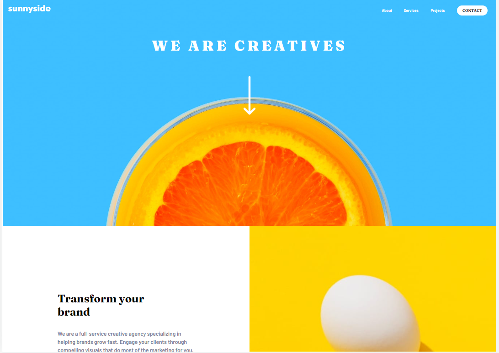
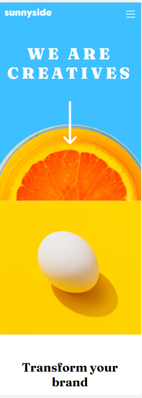

# Frontend Mentor - Sunnyside agency landing page solution

This is a solution to the [Sunnyside agency landing page challenge on Frontend Mentor](https://www.frontendmentor.io/challenges/sunnyside-agency-landing-page-7yVs3B6ef). Frontend Mentor challenges help you improve your coding skills by building realistic projects.

## Table of contents

- [Overview](#overview)
  - [The challenge](#the-challenge)
  - [Screenshot](#screenshot)
  - [Links](#links)
- [My process](#my-process)
  - [Built with](#built-with)
  - [What I learned](#what-i-learned)
  - [Useful resources](#useful-resources)
- [Author](#author)


## Overview

### The challenge

Users should be able to:

- View the optimal layout for the site depending on their device's screen size
- See hover states for all interactive elements on the page

### Screenshot





### Links

- Solution URL: [Add solution URL here](https://your-solution-url.com)
- Live Site URL: [Add live site URL here](https://your-live-site-url.com)

## My process

### Built with

- Semantic HTML5 markup
- CSS custom properties
- Flexbox
- CSS Grid


### What I learned


```html

<p class="more"><a href="#"><mark class="mark1">Learn more</mark></a></p>

```


### Useful resources

- [resource 1](https://stackoverflow.com/questions/43683187/how-can-i-create-custom-underline-or-highlight-for-text-in-html-or-css) - This helped me to make mark under text.


## Author


- Frontend Mentor - [@ytifflee7784](https://www.frontendmentor.io/profile/tifflee7784)
- Twitter - [@CodeTiffanyL](https://www.twitter.com/CodeTiffanyL)


